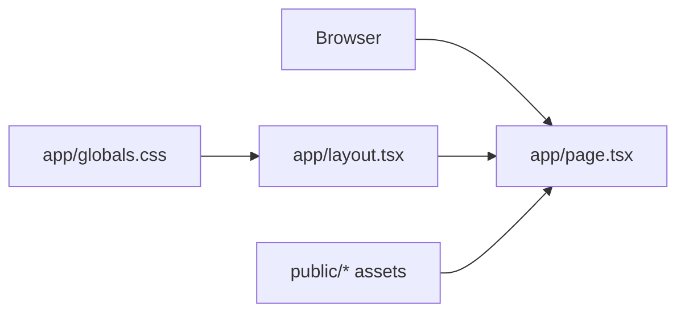

# Current Architecture

**Pattern:** Minimal Next.js App Router starter application.

## High-Level Structure

## Observed Patterns

### App Router Routing

**Location:** `app/layout.tsx`, `app/page.tsx`
**Purpose:** The root layout wraps one generated landing page.
**Implementation:** Server Components are used by default; there are no route handlers or client components.

### Styling

**Location:** `app/globals.css`
**Purpose:** Defines Tailwind CSS import, font variables, and light/dark base colors.
**Implementation:** Tailwind CSS 4 CSS-first configuration.

## Current Data Flow

The starter page renders static content and static images. There are no data reads, mutations, sessions, APIs, or external integrations to reuse.

## Implication For The Feature

World Cup prediction functionality is a new vertical slice. It can remain one straightforward Next.js application: App Router pages and Server Actions, small `lib/` server modules, Prisma/PostgreSQL storage, and Auth.js/Keycloak authentication. No existing architectural boundary needs migration.
